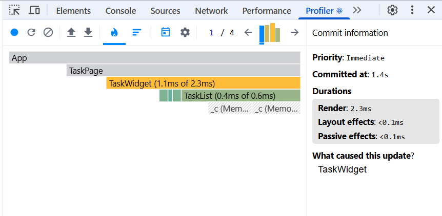

# Скриншот Profiler для урока оптимизации производительности:

- Видим на скришоте отмеченный жёлтым TaskWidget компонент, который перерендеривался когда менялся в нём state фильтра (все, невыполненные, выполненные) и удалялась одна задача 1.1ms (из 2.3ms)
- Видим зелёным перендер TaskList, он не был причиной перерендера, изменялся его props - tasks, при этом props removeTask не изменился, так как в кастомном хуке функция обёрнута в useCallback и ссылка стабильна
- Видим заштрихованные области TaskCard - каждая и карточек завёрнута в memo, поэтому если props у них не менялись, то они не перерендерелись.
- Кэширование результатов фильтрации filteredTasks с помощью useMemo не даёт большого выйгрыша, так как функция фильтрации лёгкая и массив небольшой
